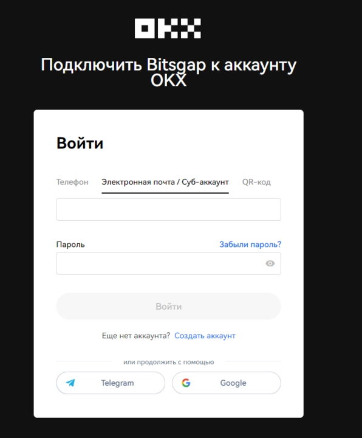
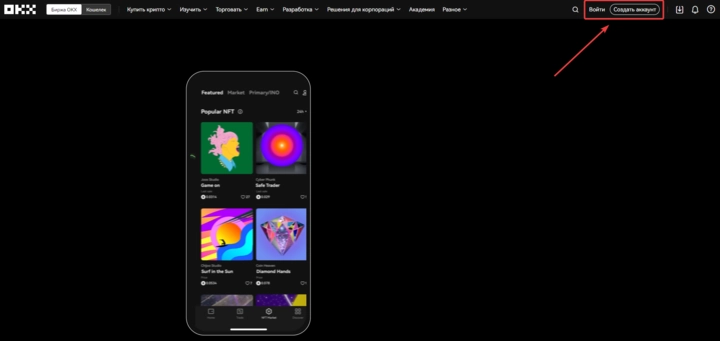
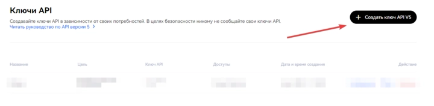

# 如何在OKX交易所创建和配置API密钥

---

想通过第三方工具管理加密货币交易，却不知道如何安全连接交易所？很多交易者在使用量化平台或自动化工具时，都会遇到API配置的困扰。本文将手把手教你在OKX创建API密钥的完整流程，包括快速授权和手动配置两种方式，让你在几分钟内就能安全地将OKX账户与第三方平台连接，开启自动化交易之旅。

---

## 什么是API密钥？为什么要用它

API密钥就像一把"特制钥匙"，它能让第三方平台代替你在交易所执行操作——下单、查询余额、查看历史记录等，但重点是：**它不会泄露你的账户密码，也无法进行提现操作**。

这种方式既方便又安全。你只需要创建一次API密钥，就能在Bitsgap这样的平台上管理多个交易所账户，实现跨平台交易策略，而不用反复登录不同网站。

## 两种创建方式：快速授权 vs 手动配置

OKX提供了两种创建API密钥的方法：

- **快速授权（Fast API）**：适合嫌麻烦的人，一键完成，自动配置
- **手动配置**：适合想要更多控制权的人，自己设置每个参数

下面分别说说这两种方法怎么操作。

---

## 方法一：OKX Fast API（推荐新手）

这是最省事的方法。OKX的Fast API使用OAuth 2.0协议，你只需要授权一下，API密钥就会自动创建并连接到Bitsgap，全程加密传输，安全性有保障。

### 操作步骤

**1. 进入Bitsgap的"我的交易所"页面**

登录你的Bitsgap账户，找到"我的交易所"页面，点击**[添加新交易所]**按钮。

**2. 选择OKX并点击"快速连接"**

在交易所列表中找到OKX，选择"快速连接"选项，然后点击**[连接]**按钮。

**3. 授权权限**

你会被跳转到👉 [OKX官网](https://www.okx.com/join/62834398)的授权页面，这里会显示Bitsgap需要的权限清单。

别担心，这些权限只是用来读取你的账户信息和执行交易，**不会获取你的个人数据或提现权限**。

输入你的OKX账户信息，点击**[登录]**完成授权。

**4. 确认连接成功**

授权完成后，你会自动回到Bitsgap的"我的交易所"页面，这时候OKX已经出现在你的交易所列表里，状态显示为**已连接**，还能看到你的可用余额。

搞定！整个过程不到两分钟。

---

## 方法二：手动创建API密钥（适合进阶用户）

如果你更喜欢自己控制每个细节，或者因为某些原因无法使用快速授权，那就选手动配置。虽然步骤多一点，但其实也不复杂。

### 操作步骤

**1. 登录OKX平台**

打开👉 [OKX官网](https://www.okx.com/join/62834398)，登录你的账户（没有账户的话先注册一个）。

**2. 进入API密钥管理页面**

点击右上角的账户设置图标，找到**"API密钥"**选项进入。

**3. 创建V5版本的API密钥**

点击**[创建API密钥V5]**按钮。注意一定要选V5版本，因为这是OKX目前主推的版本，功能更完善。

**4. 选择创建目的**

在"目的"一栏选择**"绑定第三方应用"**，然后在"应用名称"列表里找到Bitsgap。

**5. 配置API密钥参数**

给你的API密钥起个名字（随便起，只要你自己认得出来就行），然后设置一个**密码短语（passphrase）**。

**重点来了：这个密码短语是你自己设定的，每个API密钥都是独立的。一定要记下来，待会儿连接Bitsgap时要用！**

接下来配置权限，按照下面的设置打勾：

- **读取** – 开启
- **交易** – 开启

输入验证码，点击**[确认]**。

**6. 保存API密钥和密钥对**

现在你的API密钥创建好了！OKX会显示**API密钥**和**密钥对（Secret Key）**，把它们复制到安全的地方（比如密码管理器），因为这个页面关掉后就再也看不到了。

**7. 返回Bitsgap添加交易所**

回到Bitsgap的"我的交易所"页面，点击**[添加新交易所]**。

**8. 填入API信息**

在弹出窗口中选择OKX，然后选择"手动连接"方式，依次填入：

- **API密钥**
- **密钥对**
- **密码短语（passphrase）**

填完后点击**[连接]**。

**9. 验证连接状态**

如果一切顺利，OKX就会出现在你的交易所列表中，状态显示为**已连接**，并且能看到你的账户余额。

---

## 结语

无论选择快速授权还是手动配置，整个流程都不算复杂。快速授权适合追求效率的用户，手动配置则给你更多控制权。创建完API密钥后，你就能通过Bitsgap这样的平台实现跨交易所管理、自动化交易等功能。如果你还没有OKX账户，不妨从👉 [注册OKX](https://www.okx.com/join/62834398)开始，使用邀请码**62834398**，体验更便捷的加密货币交易方式。
